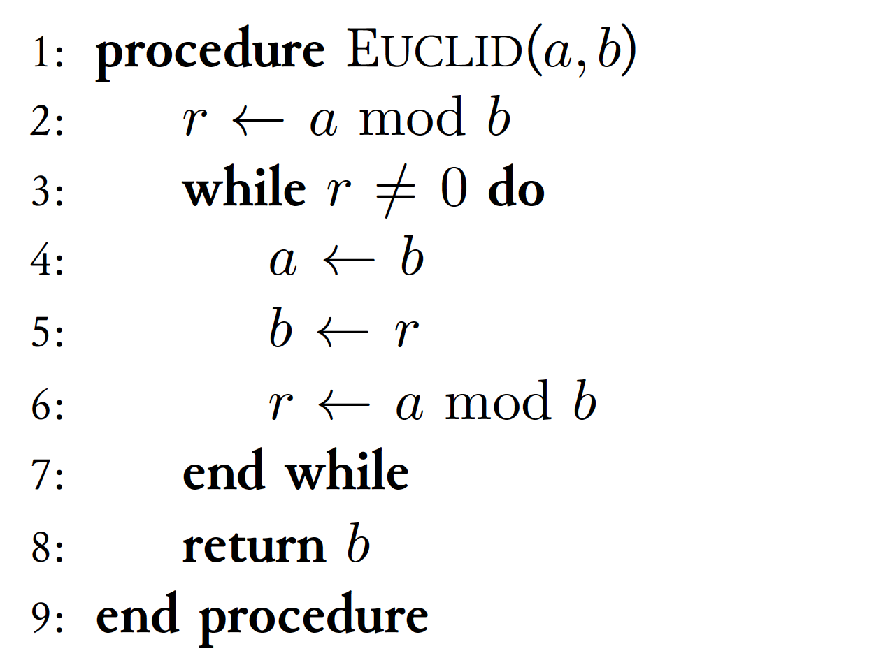
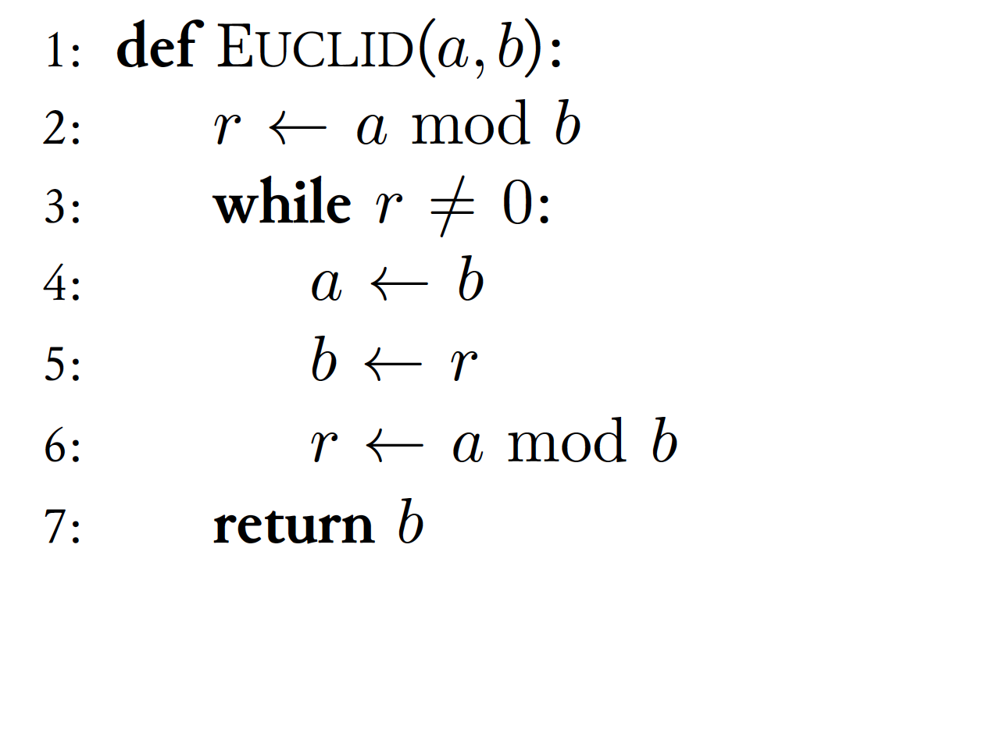
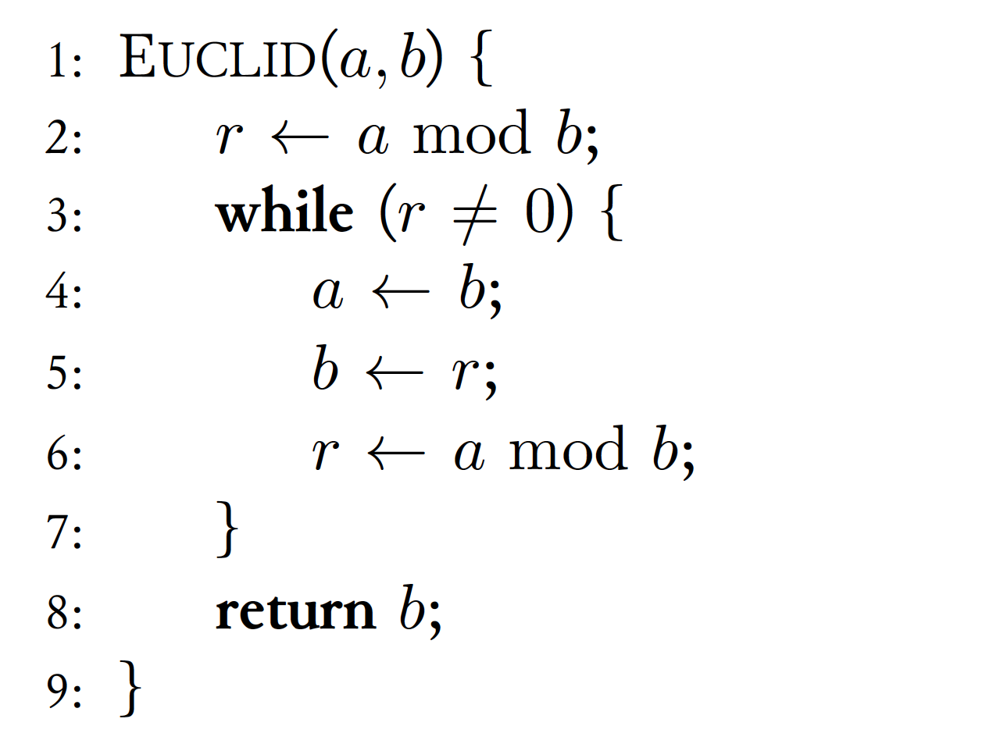

# satysfi-algorithm

[](https://github.com/pickoba/satysfi-algorithm/actions/workflows/ci.yml)

Typesetting algorithms in pseudo-code. It is the equivalent of the algorithmicx package in LaTeX.

## Demo with Gitpod

You can try this library on the web using Gitpod. Click the button below to start a new environment:

[](https://gitpod.io/#https://github.com/pickoba/satysfi-algorithm/blob/main/doc/manual.saty)

## Installation

Use [Satyrographos](https://github.com/na4zagin3/satyrographos) to install this library.

```sh
opam install satysfi-algorithm
satyrographos install
```

## Usage

To use this library, simply load these packages:

```satysfi
@require: algorithm/algorithm
@require: algorithm/style/default
```

then you can write

```satysfi
+algorithmic<
  +Procedure{Euclid}{${a, b}}<
    +State{${r \gets a \bmod b}}
    +While{${r \neq 0}}<
      +State{${a \gets b}}
      +State{${b \gets r}}
      +State{${r \gets a \bmod b}}
    >
    +State{\Return{${b}}}
  >
>
```

The command names (`+Procedure`, `+State`, `+While`, ...) are roughly the same as in LaTeX's algorithmicx package.

A few things to note:

1. Blocks other than `+If`, `+ElsIf`, `+Else` are automatically closed. (No need to write `+EndWhile`, etc.)
2. Use `\Comment` or `+Comment` for comment

### Styling

There are three built-in styles: `default`, `python`, and `c`. They can be switched by changing the file loaded with `@require`.

| default | python | c |
|:-------:|:------:|:-:|
||||

See the [manual](doc/manual.pdf) for details.

## License

MIT, See [LICENSE](./LICENSE) for more information.
